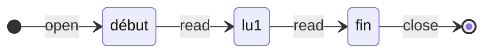

# TD5 :  Typage Avancé

### 1. Types Fantôme

*ex : *
```ocaml
type 'a list = [] of 'a * 'a list

type 'a truc = t of int
```

```ocaml
let F = open_ "abc" in
let (c, F') = read F in
(* let (c', F') = read F' in  
=> renvoie une erreur car F' est de type fin fichier*)
let close F
```

`in_channel` mets en lecture les fichiers dans la librairie std
`open_in` ouvre un fichier dans la librairie std

#### Exercice 1



```ocaml
type debut
type lu1
type fin
val open_ : string -> debut Fichier
val read1 : debut Fichier -> char * lu1 Fichier
val read2 : lu1 Fichier -> char * fin Fichier
val close : fin Fichier -> unit


let read1 = (input.char F, F)
let read2 = ...
```

Arithmétique de Peano : 
$$
\begin{aligned}
&0 \in  \mathbb{N} \\
&\forall n,\ s(n) \in  \mathbb{N}
\end{aligned}
$$

```ocaml
type zero
type _ succ
val open_ : string -> zero Fichier
val read : 'n Fichier -> char * 'n succ Fichier
val close : zero succ succ Fichier -> unit
```
```ocaml
type even
type odd
type _ Fichier
val open_ : string -> (even * odd) Fichier
val read : ('a, 'b) Fichier -> char * ('b * 'a) Fichier
val close : (even * odd) Fichier -> unit
```
---
### 2. Type non uniforme

ici `place` remplace `perfect_tree`.

#### Exercice 2
```ocaml
type 'a place = Empty
	| Node of 'a * ('a * 'a) place

let t = Node(1,((2,3),Node(((4,5),(6,7), Empty)))) (*exemple*)

val split : ('a * 'a) place -> ('a place * 'a place)

let rec split : type a . a place -> (a place * a place) = 
fun t -> match t with
	| Empty -> (Empty, Empty)
	| Node((t1,t2),q) -> let (q1,q2) = split q
		in (Node(t1,q2),Node(t2,q2))
```

#### Exercice 3
```ocaml
val merge : 'a place -> 'a place -> ('a * 'a) place

(* Node(3,Node((2,5),Empty)) => int place
Node(6,Empty) => int place
place non fusionable
*)

type zero
type _ succ
type ('a, _) place =
	| Empty : ('a * zero) place
	| Node : 'a * (('a * 'a), 'p) place -> ('a, 'p succ) place

let rec split : type a p . ((a * a), p) place -> ((a, p) place * (a, p) place) =
function
| Empty -> (Empty, Empty)
| Node((t1,t2),q) -> let (q1,q2) = split q in (Node(t1,q1),Node(t2,q2))

let rec merge : type a p . (a, p) place -> (a, p) place -> (a * a, p) place =
fun t1 t2 -> match (t1, t2) with
	| Empty,Empty -> Empty
	| Node(a1,q1),Node(a2,q2) -> let q = merge q1 q2 in Node((a1,a2),q)
```

### 3. GADT
#TODO 
```ocaml
type _ repr =
| Int : int -> int repr
| Add : (int -> int -> int) repr

let eval : type a. a repr -> a =
	function
	| Int i -> i
	| Add -> (fun a b -> a+b)

eval Add (eval (Int 3) eval(Int 5))
```
---
[[TD4 Les modules]] | [[0. Sommaire PF|Sommaire]] | [[TD6 Les flux]]

#TD/PF 