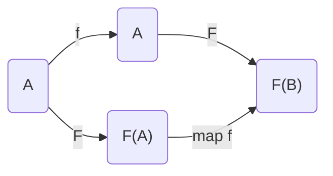
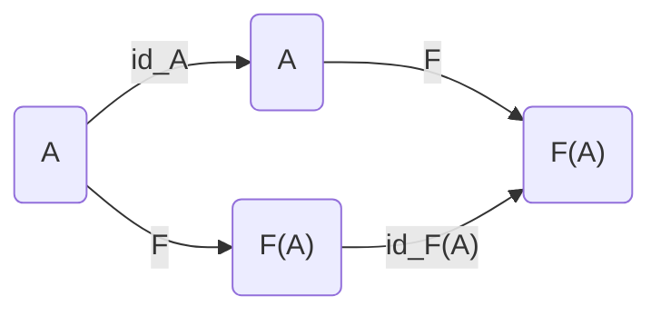
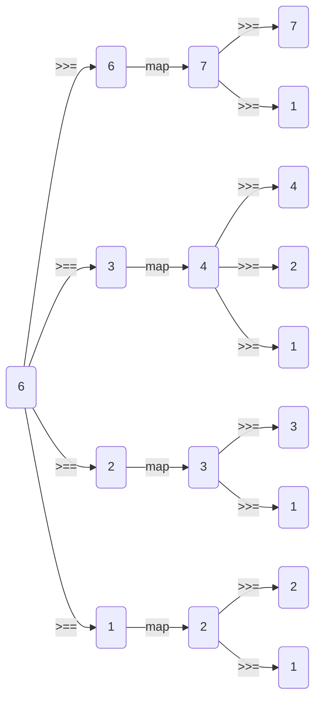

# TD7 : Structures monadiques

le type `FONCTEUR` ressemble à une fonction sur les types (*cf. la théorie des catégories*)



*exemple : +1 sur un entier => +1 sur une liste d'entier*



Le `FONCTEUR` préserve la structure mais est irréversible

Monade $\approx$ Monoïde

`return` : wrap
`bind` : séquence de calculs



pour une monade
`map f S =` $\{ s' \ | \ s' = f(s), \ s \in S \}$
`return a = ` $\{ a \}$
`S >>= f =` $\bigcup \{ f(a) \ | \ a \in S \}$

---
## Exercice 1

```ocaml
type 'a t = Iter of 'a node Lazy.t
and 'a node = ('a * 'a t) option

let uncons (Iter i) =Lazy.force i

let return x = Iter(lazy(
	Some(x, Iter(lazy None)
))

let rec map f a = Iter(lazy(
	match (uncons a) with
	| None -> None
	| Some(t,q) -> Some(f t,map f q)
))

let zero = Iter(lazy None)

let rec (++) l1 l2 = Iter(lazy(
	match (uncons l1) with
	| None -> uncons l2
	| Some(t,q) -> Some(t,q ++ l2)
))

let rec (>>=) a f = Iter(lazy(
	match (uncons a) with
	| None -> None
	| Some(t,q) -> uncons((f t)++(q>>+f))
))
```

---
## Exercice 2
```ocaml
module type WT = sig type t end

module WRITER (W : WT) (*: MONADE*) =
	struct
		type 'a t = 'a * W.t Flux.t
		
		(*tell : W.t -> unit t*)
		let tell m = ((),Flux.(cons m vide))

		let map f (v,t) = (f v, t)
		let return x = (x, Flux.vide)
		let (>>=) (a,t) f = let (b,w) = f a 
			in (b,Flux.append t w)

		let run (v,m) = (v,m)
	end
```

---
## Exercice 4
```ocaml
type 'a t = s -> ('a * s)

let map f x = fun s ->
	let (a,s') = (x,s) in (f a,s)

let return x = fun s -> (x,s)

let (>>=) a f = fun s0 ->
	let (va,s1) = a s0 in (f va) s1
```

---
[[TD6 Les flux]] | [[0. Sommaire PF|Sommaire]] |[[TD9 Les continuations]]

#TD/PF 